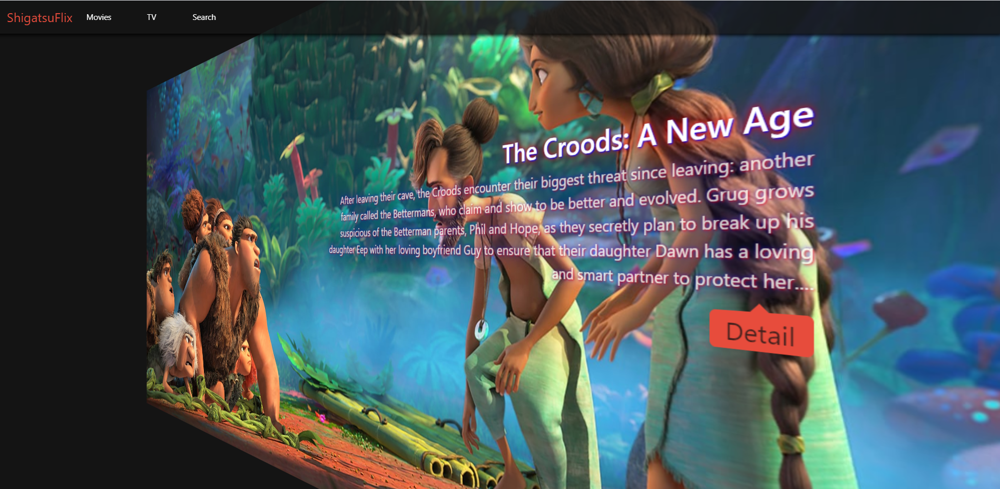
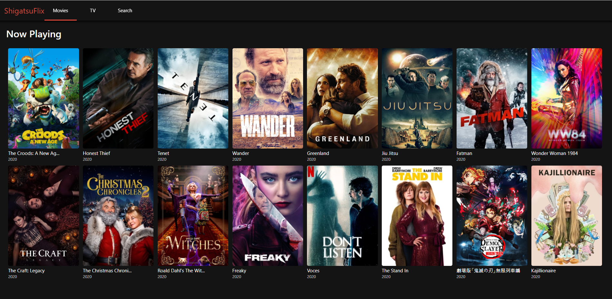
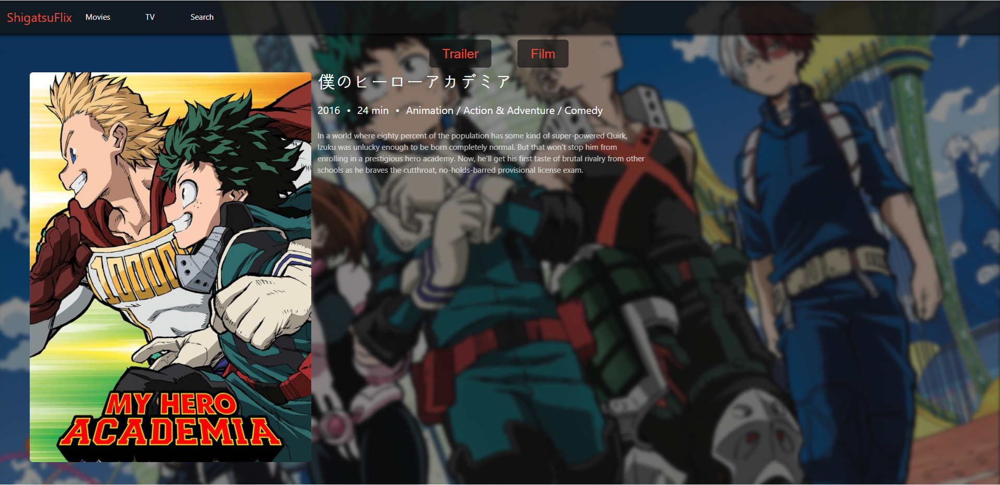
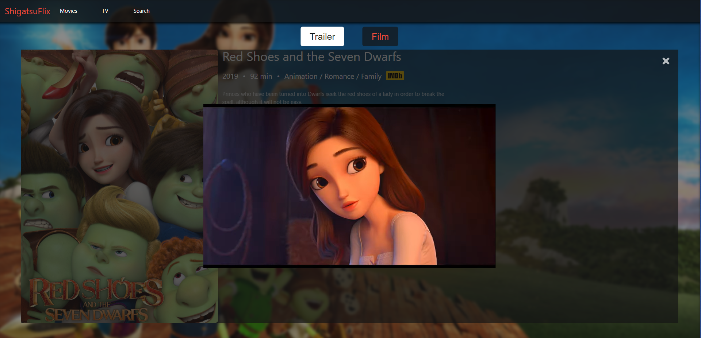
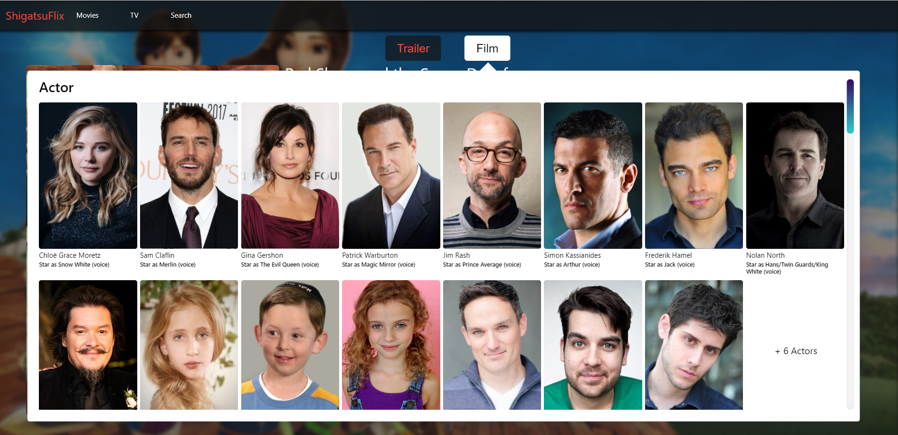
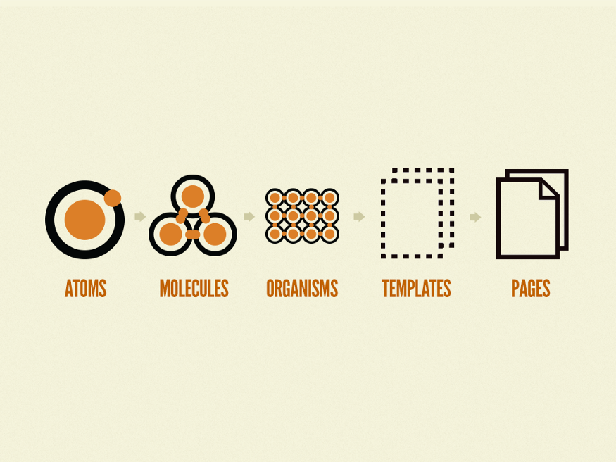

# ShigatsuFlix

Learning React and ES6 by building a Movie Discovery App.

\+ Refactorying ShigatsuFlix(React) Branch with React Hook.

If you want to see before refactoring, go to the link next to it. -> [ShigatsuFlix(React)](<https://github.com/ShigatsuEl/shigatsuflix/tree/ShigatsuFlix(React)>)

## Demo

[ShigatsuFlix with React](https://shigatsuflix.netlify.app/)

## Preview

<br>

<br>

<br>

<br>

<br>

## Tech Stack

| Frontend |      Technology       |      Description       |
| :------: | :-------------------: | :--------------------: |
|    01    |         React         |          CRA           |
|    02    |      React Hook       | Functional Programming |
|    02    |   Styled Components   |      Replace CSS       |
|    03    |     React Router      |    react-router-dom    |
|    04    | Container & Presenter |        Pattern         |
|    05    |         Axios         |        TMDB API        |

<br>
No Backend

## Directory Structure

```
public
|-- loading.gif
|-- noPosterSmall.png
src
|-- actions
|   |-- tmdbAction.js
|-- api
|   |-- api.js
|-- components
|   |-- Actor.js
|   |-- Content.js
|   |-- Crew.js
|   |-- GlobalStyles.js
|   |-- Header.js
|   |-- Loader.js
|   |-- Message.js
|   |-- Poster.js
|   |-- Production.js
|   |-- Recommandation.js
|   |-- Season.js
|   |-- Similarity.js
|   |-- Slide.js
|-- contexts
|   |-- tmdbContext.js
|-- reducers
|   |-- tmdbReducer.js
|-- routes
|   |-- Detail
|   |   |-- DetailContainer.js
|   |   |-- DetailPresenter.js
|   |   |-- index.js
|   |-- Home
|   |   |-- HomeContainer.js
|   |   |-- HomePresenter.js
|   |   |-- index.js
|   |-- Movie
|   |   |-- index.js
|   |   |-- MovieContainer.js
|   |   |-- MoviePresenter.js
|   |-- Search
|   |   |-- index.js
|   |   |-- SearchContainer.js
|   |   |-- SearchPresenter.js
|   |-- TV
|   |   |-- index.js
|   |   |-- TVContainer.js
|   |   |-- TVPresenter.js
|-- stores
|   |-- tmdbStore.js
|-- styles
|   |-- Theme.js
|-- system
|   |-- PostFilmData.js
|   |-- PostSectionData.js
|   |-- PostSlideData.js
|   |-- PostTabData.js
|   |-- PostTrailerData.js
|-- utils
|   |-- closeTrailer.js
|   |-- tabEnter.js
|   |-- tabLeave.js
|-- App.js
|-- index.js
|-- Router.js
```

## Screens

- Home

  > Slide a Movie Cards `1️⃣Now Playing Movies` `2️⃣Top Rated TV Shows`

- Movie

  > Three Sections `1️⃣Now Playing` `2️⃣Up Coming` `3️⃣Popular`

- TV

  > Three Sections `1️⃣Top Rated` `2️⃣Popular` `3️⃣Airing Today`

- Search

  > You can search Movies or TV Shows

- Detail

  > Two Tabs `1️⃣Trailer` `2️⃣Film`<br>
  >
  > - Trailer<br>
  >   1. Youtube Iframe Video
  > - Film<br>
  >   1. Seasons(In TV Shows)
  >   2. Actor
  >   3. Crew
  >   4. Production
  >   5. Recommandation
  >   6. Similaraty

## API

[API List](./API.md)

## Indicators

ShigatsuFlix(React-Hook) 브랜치는 하나의 지표를 가지고 있습니다.

- Hook Refactorying

위의 두가지 목표를 최우선으로 하며 [ShigatsuFlix(React)](<https://github.com/ShigatsuEl/shigatsuflix/tree/ShigatsuFlix(React)>)와 완전히 동일하게 동작하는 것이 이 브랜치의 목적입니다.<br>
따라서 이전 프로젝트에서 부족한 부분과 수정해야할 부분들은 이번 브랜치에서 리팩토링하지 않았습니다.<br>

### Hook Refactorying

현 브랜치는 지금까지 만들어왔던 ShigatsuFlix를 전부 React Hook으로 Refactorying 하는 것이 목적입니다.<br>
React Hook을 사용해 기존 React앱으로 구현한 프로젝트에서 Class Component를 Function Conpoennt로 교체해보고 Hook을 사용한 덕분에 좀더 코드를 가독성있고 간결하게 하였다.<br>
그리고 Hook으로 Refactorying하는 것 외에도 `Reducer Hook`과 `Context Hook`을 사용해 state를 전역으로 관리하는 `Redux` 대체제로 사용해보았다.<br>
Hook을 사용한 함수형 컴포넌트와 사용하지 않은 클래스 컴포넌트의 차이점을 느껴보고 서로의 장단점을 비교해보려 한다.<br>

## Reflection

> 프로젝트를 통해 느낀점을 정리한다.

### React vs React Hook

이전 브랜치에서 React만 사용해 state와 prop을 관리하기 위해서는 Class Component밖에 사용할 수 없었다. 클래스 위주의 접근을 한다는 점에서 배울점은 많았지만 반복되는 state와 로직등을 모두 하나의 클래스 안에서 처리한다는 점에 있어서 코드가 매우 길어지고 가독성도 떨어진다는 단점이 존재했다.<br>
그러나 이번 브랜치에서 React Hook을 사용하게 된 결과 Class Component -> Function Component라는 새로운 방식으로 접근할 수 있었고 함수를 분리하여 코드길이가 눈에 현저히 띌 정도로 차이를 보여줬다는 것이다.<br>
실제로 이번 프로젝트에서 가장 많은 로직을 담고 있던 DeatailContainer에서 Hook을 사용했을 때와 안했을 때는 코드길이가 절반이상 차이가 났다.<br>
게다가 React Hook은 기존 Class Component가 가지고 있는 Life Cycle 또한 useEffect훅으로 얼마든지 대체가 가능했다.<br>
결론적으로 React Hook을 사용해 Procedural Programming 하는 것이 나에게 맞았고 앞으로 React로 작업하게 된다면 Hook을 사용한 Function Component를 자주 택할 것 같다.<br>

### Managing State Globally by Using useReducer and useContext Hook instead of Redux

React를 사용하면서 가장 불편했던 점은 Component구조가 점점 더 deep diving할수록 전달해줘야하는 props와 state가 많아진다는 것이었다.<br>
Component 단계가 내려갈때마다 props와 state를 하나하나 전달해줘야 한다는 것은 그만큼 성가로운 짓이었고 잦은 실수를 유발하게 만들었다. 그래서 기왕 Hook으로 Refactorying할 것이라면 state를 전역적으로 관리해보는 것도 한 번 추가해보기로 마음먹었다.<br>
state를 전역으로 관리하기 위해 내가 선택한 방법은 React팀에서 새로나온 `useContext Hook`과 `useReducer Hook`을 이용하기로 했다.<br>
가장 좋았던 점은 이제 더 이상 Component에서 props를 하나하나 내려주지 않아도 언제든지 useReducer Hook으로부터 가져온 state와 dispatch를 import해서 사용할 수 있다는 것과 서버로부터 받아올 API 데이터들을 페이지가 이동할 때마다 요청하는 것이 아니라 React가 처음 로딩될 때 단 한번만 요청하면 된다는 장점이 있었다.<br>
프로젝트를 마무리하고 들었던 생각은 생각보다 전역으로 state를 관리하기 위해서 꽤 많은양의 코드를 요구한다는 것이었다. 프로젝트를 시작할 때 전역으로 관리할 state가 어느정도 되는지 생각해보고 굳이 전역으로 관리할 state가 많지 않다면 Component내에 state를 가지고 있는 것도 나쁘지 않은 것 같다.<br>
반대로 관리해야할 전역 state가 많다면 `useContext Hook + useReducer Hook`이나 `Redux`, 둘 중 하나를 골라서 사용하면 될 것 같다. Redux가 할 수 있는 것들은 Hook으로도 대부분 가능하기 때문에 이제 어느쪽이 확실히 좋다고 말할수는 없을 것 같다. 단지 Redux는 Redux Toolkit이라는 강력한 개발도구를 제공하기 때문에 아직은 Redux를 좀 더 선호하지 않을까 싶다.<br>

### Asynchronous setState

영화 React 앱을 만들면서 API서버에서 데이터를 받아오는 작업을 비동기로 처리해줘야 하는 상황이 많았다. 때문에 비동기 작업이 다 끝나고 나서야 state를 업데이트 할 수 있었다.<br>
문제는 내가 전에 작업했던 ShigatsuFlix(React)브랜치에서 React를 VanillaJS처럼 사용해보자라는 지표를 가지고 있었기 때문에 모든 이벤트 처리를 마치 VanillaJS에서 하듯이 사용하였고, 그 결과 Hook으로 Refactorying을 하면서 비동기 작업이 끝나지 않았는데 DOM 엘리먼트를 제어하려는 에러를 여러개 만들게 되었다.<br>
이러한 문제점을 겪고 느낀점은 React에서 VanillaJS에서 사용하듯이 Element를 제어하면 안되고 리액트에서 제공하는 JSX와 Ref를 적극 이용해야 한다.<br>
그렇지 않으면 비동기 작업이 끝나기 전에 DOM 엘리먼트를 제어하려는 실수를 남발할 것이다.<br>
결국에 내가 이 문제를 해결한 방법은 VanillaJS코드를 전부 React구문으로 Refactorying하고 이벤트와 JS구문은 해당 컴포넌트에서 직접 해결하는 방법으로 해결할 수 있었다.<br>

### Class Component vs Function Component

Hook으로 Refactorying하면서 Class Component를 Function Component로 교체할 때 가장 많은 차이점을 보였던 것 중에 하나가 바로 `this`라는 객체였다.<br>
Class Component는 this가 클래스 객체로 바인딩 되어 있기 때문에 어느 변수를 사용하든 어느 메서드를 사용하든 this를 자주 활용하게 된다.<br>
하지만 Hook으로 만든 Function Component는 this가 바인딩 되어 있지 않기 때문에 this를 자주 사용할 일은 없지만 만약 사용하게 된다면 누가 바인딩 되어있는지를 확인할 필요가 있다.<br>
Class Componet -> Function Component로 교체하면서 Youtube Trailer API에 바인드를 걸어주기 위해 함수 표현식에 this를 바인딩 해보려 노력했으나 결국 되지 않았고 한참이 지나서야 함수 표현식에서 this는 동적 바인딩되지 않는다는 것을 알게 되었다.<br>
결국 내가 몰랐던 것은 리액트가 아니라 자바스크립트의 코어였다는 것을 유튜브 클론 이후 또다시 느끼는 중이다.<br>
단지 함수로 바꿔줄 뿐이었는데 생각보다 배울점이 많았고 Class 객체에 대해서도 많은 공부가 된 것 같다.<br>

[⬆Back to Top](#ShigatsuFlix)

## Improvement

> 개선 해야할 부분들을 중점으로 다뤄본다.<br>

### Life Cycle

Hook Refactorying하면서 가장 어려웠던 것은 비동기 작업이 많아지면서 언제 state와 props가 업데이트 되는 것인지 그리고 render가 어떤 순서대로 실행되는지, 몇번 실행되는지 등을 알기가 어려웠다는 것이다.<br>
전부 Life Cycle(생명주기)가 정확히 어떠한 순서대로 작동하는지 자세하게 알지 못했기 때문에 어려움이 있었다고 생각되는 바이다.<br>
Life Cycle에 관련된 문서들은 굉장히 많았는데 다루는 범위가 생각보다 많아 좀 더 깊게 공부해야할 필요성을 느꼈다.<br>

### Automic Design

ShigatsuFlx(React Hook)의 폴더 구조를 알기 쉽게하기 위해서 `Container Presenter` 패턴을 사용했습니다.<br>
Conatiner Presenter 패턴은 Container Component에서 데이터를 처리하는 로직을 담당하고 그 데이터를 Presenter Component에 Prop으로 전달해주어 Presenter Component에서 UI를 구성하여 역할을 구분짓는 패턴입니다.<br>
따라서 디렉토리 내의 세분화가 이루어져 검색하기가 굉장히 쉬워졌다.<br>
한가지 불편했던 점이 있었다면 프로젝트의 크기가 커짐에 따라 한 파일에 너무 많은 로직을 담게 되었고 별로 좋지 못한 코드의 가독성을 보여주게 되었다.<br>
처음 리액트 프로젝트였기 때문에 코드 정리를 많이 못한 점도 있지만 현재 ShigatsuFlix의 코드 상태는 앞서 생긴 문제점으로 인해 굉장히 코드가 읽기 힘든 부분도 존재한다.<br>
개인적인 성향이긴 하지만 폴더와 파일이 많아지더라도 많은 양의 코드를 작은 부분으로 세분화하여 코드를 분리하는 것이 나의 성향에 맞는 듯 했다.<br>
그렇게 코드를 간결하게 하는 폴더 구조 컨벤션을 찾아보다가 `Automic Design` 패턴을 찾게 되었다.<br><br>
<br>
Automic Design은 마치 원소와 같은 개념을 프로젝트에 적용한 것인데 위에 보이는 Atoms에 해당하는 것은 프로젝트에서 버튼, 제목 등 하나의 JSX 엘리먼트로 바라보았고 그러한 Atoms가 모여 하나의 Molecule을 만드는데 이것은 최소 하나의 역할을 수행할 수 있게 된 그룹으로 정의합니다.<br>
다음으로 여러개의 Mocules가 모여 하나의 인터페이스를 형성하여 이를 Organism이라 부르며 header, footer 등과 같은 layout에 해당합니다.<br>
또한 organism은 여러개가 모여 하나의 template을 담당하고 어떠한 template을 구성하는지 정하는 page로 마무리 됩니다.<br>
여기서 Atoms | Mocules는 최대한 시스템과 독립적으로 설계되는데 그 덕분에 어디서든지 재사용이 쉽게 이루어질 수 있게 됩니다. 이것은 ShigatsuFlix에서 재사용이 이루어지지 못해 한 파일 내에 매우 많은 로직과 UI를 담게 되는 일을 방지할 수 있을 것 입니다.<br>
그리고 이와 반대로 시스템에 의존적이며 중요한 정보를 담게되는 역할은 page와 template가 담당하며 서버에서 받아오는 데이터들과 전역 state를 뿌려주는 담당을 합니다.<br>
이러한 프로젝트 설계는 오랜 시간동안 디자인 설계를 하게 되겠지만 레이아웃을 좀 더 이해할 수 있게 되고 ShigatsuFlix에서 하지 못한 재사용 가능 컴포넌트를 만드는 연습을 할 수 있을 것 같다는 생각이 든다.<br>
이번 프로젝트를 다시 위의 디자인 관점으로 설계하기엔 무리가 느껴지지만 다음 프로젝트를 시도할 때는 언젠가 해보리라 다짐한다.<br>

[⬆Back to Top](#ShigatsuFlix)

## Move Forward

### React Hook with TypeScript

TS를 익숙하게 다룰 때쯤 다시 프로젝트로 돌아와 React Hook과 TS를 섞어서 Refactorying 해볼 계획이다.<br>
최근에 TS를 배우고 있는데 JS에 비해 엄격해서 내가 실수하고 있는 부분을 좀 더 구체적으로 알려주기 때문에 이번 프로젝트에서 굉장히 많은 실수를 했던 비동기 작업에 TS를 같이 사용한다면 어떨까라는 생각이 들었다.<br>
이렇게 TS와 React를 함께 작업했을 때와 그저 React만 사용해서 작업했을 때, 내가 TS를 사용해서 코드가 많아지는게 불편하게 느낄 것인지 아니면 TS를 사용함으로써 더욱 오류를 찾는 것이 쉬워질 것인지 경험할 계획이다.<br>
아직은 TS 기본문법에 익숙치 않은데다 TS와 React를 같이 사용하려면 그에 관한 공부도 더 해줘야 하기 때문에 시간이 조금 걸릴 것이라 예상 중이다.<br>

### React Official Documentation

위해서 겪었던 문제들과 해결하지 못했던 문제들을 다시 해결하기 위해서 이번엔 모르는 채로 시작하지 않고 React 공식문서를 처음부터 끝까지 정독할 계획이다.<br>
지금까지는 문제에 직면하면 그때그때 찾아서 해결하는 방식으로 해왔지만 아직 모르는 부분이 많다고 생각되어 공식문서를 정독한 후 내가 전에 왜 해결하지 못했는지 또는 너무 미련한 방법으로 해결해오지는 않았는지를 검토할 수 있을 것이다.<br>
그리고 만약 검토한 내용들 중 수정할 부분이 생긴다면 추후 다시 업데이트 할 예정입니다.<br>

[⬆Back to Top](#ShigatsuFlix)

## Finally

React를 React Hook으로 Refactorying하는 것은 내 예상보다 훨씬 어려웠다. 단순히 Hook 개념 자체가 어려워서 그런 것이 아니라 주로 사용해보지 않은 Class Component를 Function Component로 교체했을 때 어려움에 직면했고 대부분의 어려운 문제들은 내가 ES6이후의 Class 문법에 대해 정확히 알고 있지 못한 경우에 느끼게 되었다.<br>
Class Component -> Function Component로 교체하는 것인데 오히려 Class에 대해 더 자세히 알 수 있게 되었고 끝에 가서 Class와 Function 둘 다 다룰 줄 알게되니 Class가 어렵다던가 Function이 어렵다던가 그런 것이 아니라 결국 둘 다 똑같은 역할을 하고 있음을 알 수 있었다.<br>
또한 Class Component -> Function Component로 되면서 동작하던 부분이 에러가 발생하는 경우는 React를 몰라서가 아니라 JS를 제대로 알지 못해서 그런 경우가 많았고 덕분에 자연스레 JS를 다시 공부하는 계기가 되었던 것 같다.<br>
앞으로의 계획은 JS를 배우는 겸 TS도 같이 배울 계획이다. TS에서는 Class를 사용할 때 강력한 시너지를 발생한다고 알고 있는데 TS를 따로 배운 후 추후에 Class와 함께 새 React + TS 프로젝트를 만들지 아니면 지금 이 프로젝트를 TS로 Refactorying 할지 고민 중이다.<br>
어쩌면 둘다 할지도 모르겠다. 어찌됐든 프론트 목표인 TS와 React를 주로 사용하기 위해서 얼마 남지 않은 것 같다. TS와 React를 내 마음대로 가지고 놀 정도가 된다면 그때 나만의 포트폴리오를 시도해보는 것도 괜찮을 것 같다.<br>

[⬆Back to Top](#ShigatsuFlix)
